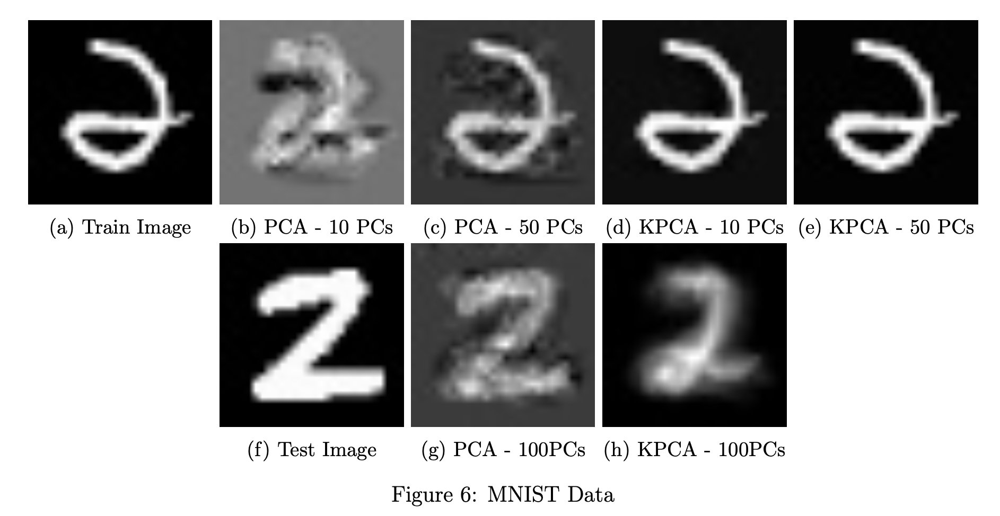
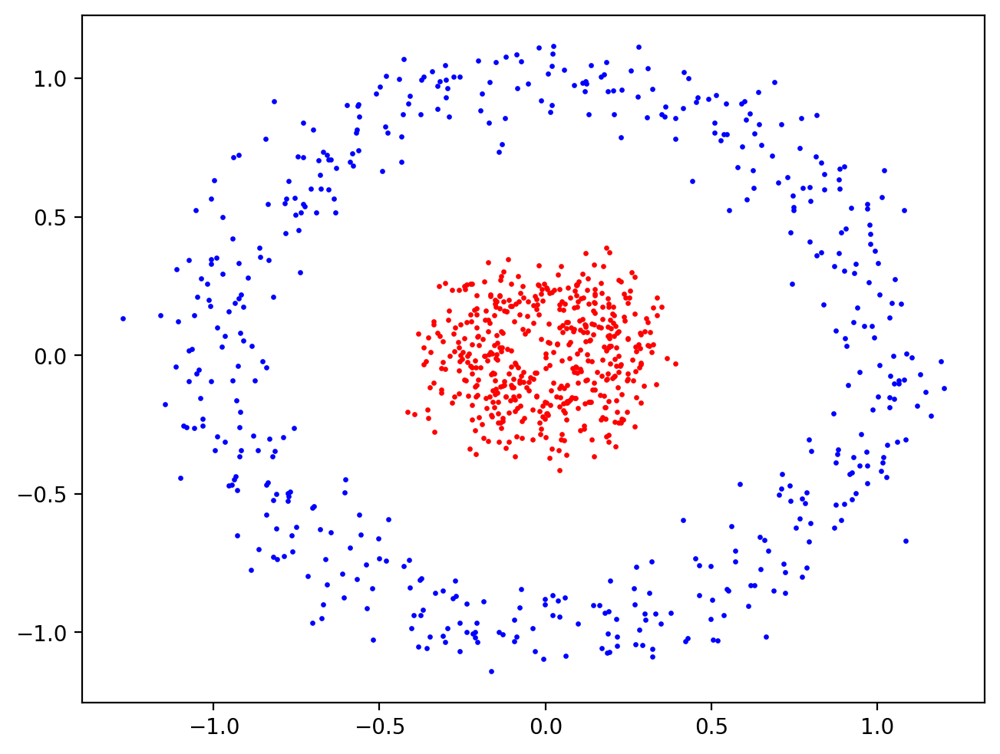
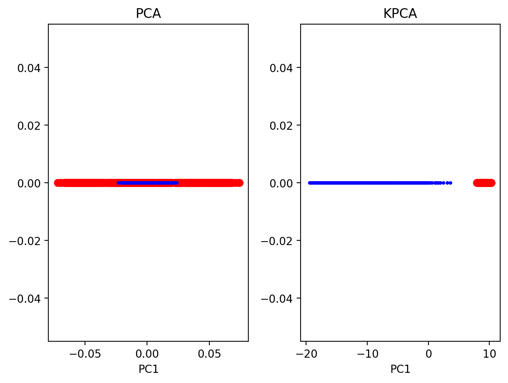

# Kernel Principal Component Analysis

Python implementation of Kernel PCA dimensionality reduction technique. Additionally, a reconstruct method is provided that solves the pre-image problem by solving a non-convex optimization problem using fixed point iteration.

## Example Outputs

### Reconstruction of images in MNIST dataset after using KPCA to reduce dimensionality.
<p align="center">
  
</p>

### Illustration of toy data becoming linearly separable after using KPCA to reduce its dimensionality.
<p align="center">
  
  
</p>


## Usage


```python

# Step 1. find the principal subspace of a dataset after its undergone a non-linear mapping

# 1a. Generate toy data (concentric circles)
X, y = sk_make_circles(n_samples=1000, random_state=123, noise=0.1, factor=0.2)

# 1b. initialize KPCA object. This learns the principal subspace using data X
kPCA = KernelPCA(X)

# 1c. get first two principal components in new space
X_new = kPCA.A[:, :2].T

# Step 2. Use principal subspace we found to perform dim. reduction on a new datapoint a
a_reduced = kPCA.inference(a)

# Step 3. Use reduced vector a_reduced, to obtain a reconstruction a_hat in the original space. This step uses 
# Fixed Point Iteration to solve a non-convex optimization problem, so an initial guess is needed.
a_hat = kPCA.reconstruct(a0, a_reduced) 
